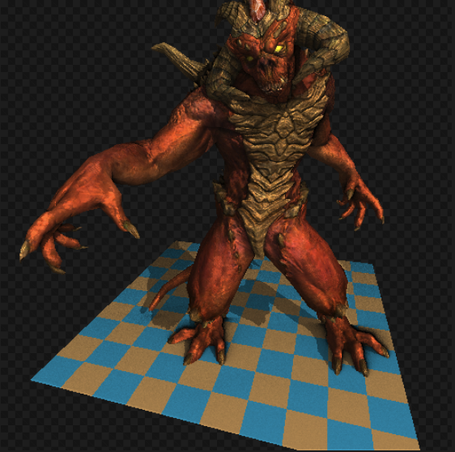

# TinyRenderer
This is my practice repository when I was following the course [TinyRenderer](https://github.com/ssloy/tinyrenderer/wiki/).

This is a rasterization 3D software renderer which can generate an image looks like that:

Every sub-directory is loosely corresponds to a lesson in that course. I basically worked through the course twice. The first pass I just code along while I was reading through the material, after that I started from scratch at directory `cleanslate` and implemented all features from rasterizer, transformation,.etc all the way to the SSAO based on my own understanding to test if I realy grasp those ideas.